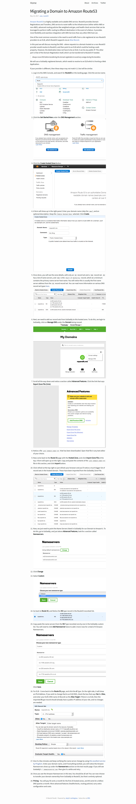
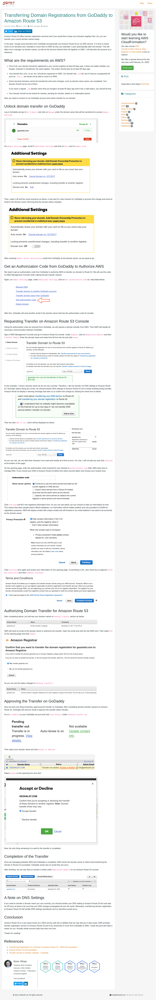

# Domain Migration from Godaddy to AWS Route53.

## Overview

In this documention, a guideline has been provided regarding the migration of domain from godaddy to aws route53.

## Guidelines

We will follow two steps:

1. Changing the nameserver on godaddy from default to amazon route53 nameserver:

2. Transfering the ownership:

### Sources

1. https://lobster1234.github.io/2017/05/10/migrating-a-domain-to-amazon-route53/

2. https://blog.shikisoft.com/transferring-domain-registrations-from-godaddy-to-amazon-route-53/