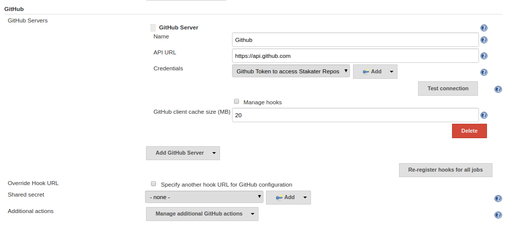

# Troubleshoot gitwebhookproxy for github

1. Check the logs of gitwebhookproxy and see if there is no unmarshling error.
    - if github event is push then there should be no unmarshling error for push hook
    - if github event is pull request then there should be no unmarshling error for pull request hook
2. Verify that your github repo has gitwebhookproxy url set as webhook url
3. Verify that your pipeline configuration has gitwebhookproxy url set as override url
4. Verify that your pipeline configuration and github has same secret.
5. Verify that your pipeline configuration has `(PR-\d+|master)` regex set. i.e. this regex triggers only PR and master branch.
6. Verify from the gitwebhookproxy logs that github event is supported. If it is not then add that event payload in gitwebhookproxy as well.

# Sample Jenkins Configuration

