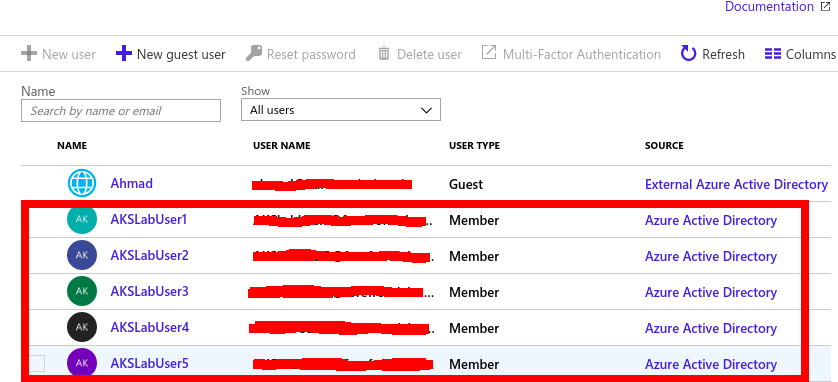
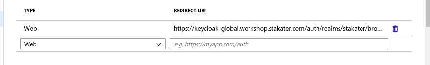

# Steps to configure Microsoft KeyCloak with Azure Active Directory

0. Follow [this](https://docs.microsoft.com/en-us/azure/aks/azure-ad-integration#deploy-cluster) tutorial if you want to deploy Azure Active directory with Azure Kubernetes Service AKS

1. Create Users in Azure using the Administrator account using the [this](https://docs.microsoft.com/en-us/azure/active-directory/fundamentals/add-users-azure-active-directory). The new Users will be shown as source *Azure Active Directory* as below

2. Go to your Azure AD instance, select *App Registrations* on the left panel and click *Endpoints* on the top panel displayed. Copy values for *OAuth 2.0 authorization  endpoint (v2)* and *OAuth 2.0 token endpoint (v2)* values. these will be used in the Keycloak configurations.

3. Go to your Azure AD instance, select *App Registrations* on the left panel and Select Azure AD Client Application created when Azure Active directory was created. Copy the *Application (client) ID*. Click *Certificates and Secrets* from the left panel and click *New Client Secret* button and create a new secret. Copy the value of the secret.

4. After the users are created open Keycloak administrative console and Select Identity Providers in the left panel.

5. Click on the Add Provider drop down and select OpenID Connect v1.0 

6. Fill in the Options as below:
  
    * alias: azure-ad
    * Display Name: Microsoft Azure AD
    * First login flow: first broker login
    * Authorization URL: (*OAuth 2.0 authorization  endpoint (v2)*)
    * Token URL: (*OAuth 2.0 token endpoint (v2)*)
    * Client ID: (*Application (client) ID*) from step 3
    * Client secret: client secret from step 3
    * Prompt: unspecified

7. Click Save to create the OIDC type Identity Provider.

8. Copy the Redirect URI form the created Identity Provider. In Azure AD instance go to App Registration, Select AD Client application, select Authentication, and paste this URI in Redirect URI field and type Web and click the add button to add.

9. Open application in browser to test Keycloak is working fine with Azure AD.