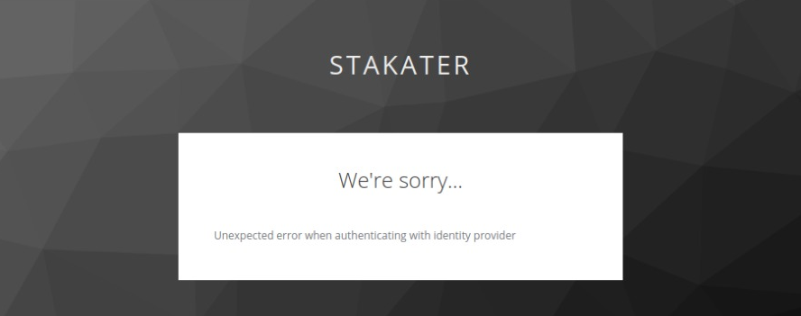

# Exporting/Importing config in KeyCloak

KeyCloak configs can be re used by exporting from one instance and importing in the other instance.

When using public helm chart this configs can be imported using the secret `keycloak-config` as below 
```
extraVolumeMounts: |
- name: keycloak-config
  mountPath: /opt/jboss/keycloak/standalone/configuration/import/stakater-realm.json
  subPath: stakater-realm.json
```

## Problems while importing settings.

Following error occured when importing settings from version `5.0.0` into version `8.0.1`




## Solution

- Always select both options when exporting config i.e. `Export groups and roles` and `Export Clients` so that all configurations are exported

- When Importing make sure `AuthenticationFlows` settings are present inside `security-realm.json`