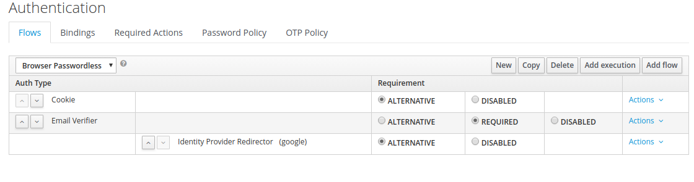

# Remove Username Password Form from KeyCloak Authentication

When URLs are redirected to get authentication with Keycloak, username password form is shown alongside email verfication which is a security risk. Only Email verification should be enabled and username password form should not pe used for providing SSO.

To remove that username password form

- Go to the administration console of the keycloak
- Select authentication From the right bar
- Click on `New` button to create a new Authentication flow and name it as per requirement. (`Browser Passwordless`)
- Add flows from the `Add Flow Button` as shown below

- Now export Keycloak configurations from the `Export` button on the left panel
- Json file will be downloaded and can be used as a configmap for HelmRelease 