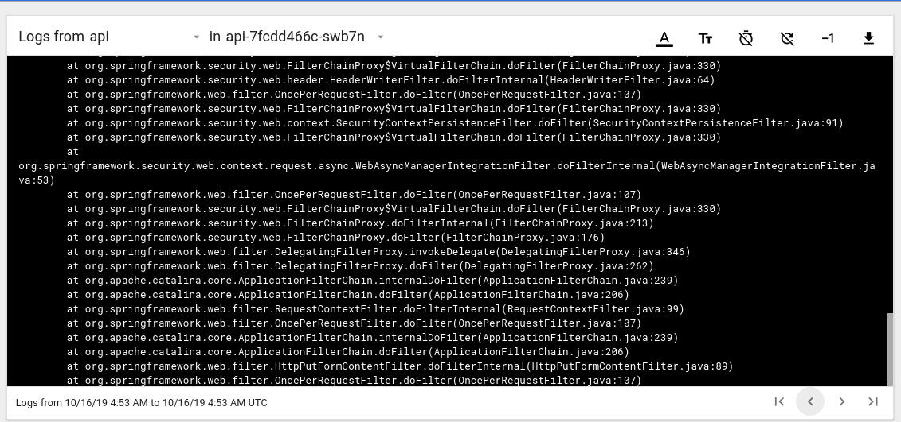

# Determining the reason for pod failure

Run the following command to view previous/terminated container logs:

`kubectl logs -n namespace-name pod-name -c container-name --previous`

To retrieve container name either go through the manifest or run the following command:

`kubectl describe pod pod-name -n namespace-name`

Also, since pod restart generates a corresponding event you can view events in that namespace or against that specific pod.
For Namespace:

`kubectl get event -n namespace-name`

For pod:

`kubectl get event -n namespace-name --field-selector involvedObject.name=pod-name`

Pods write out termination-logs at `dev/termination-log` (default path) along with that you can get info regarding last 
terminated state from

`kubectl get pod -n namespace-name pod-name -o go-template="{{range .status.containerStatuses}}{{.lastState.terminated}}{{end}}"`

This process is do-able from within the dashboard as well:

