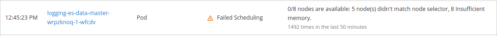
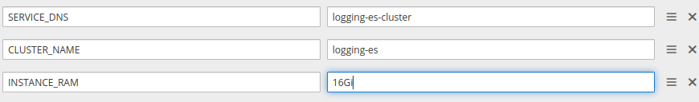
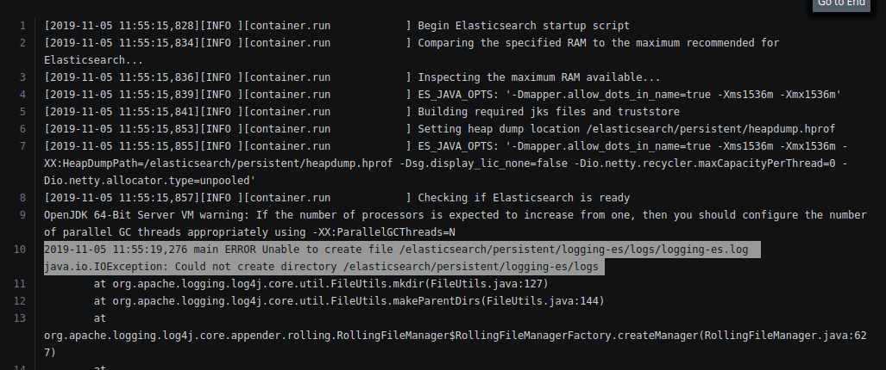

# Stack Deployment on Managed Openshift Deployed on Azure


* Common issue:

1. Openshift uses routes instead of ingress therefore routes files are added in each stack.

2. When the custom domain is provided we have to manually enter in the App domain service for the application deployed in openshift.

3. Default VM type for infra nodes is DS2_v3 which only allows 4 LUN disks to get attached. Resize the VMs after deployment. Follow steps [here](volume-attach-restriction-on-azure-ocp.md)

## Monitoring Stack Deployment

* If monitoring is enabled during deployment, a openshift-monitoring project will be deployed containing all monitoring specific services(grafana, node-exporter, prometheus and alertmanager). But the issue the grafana is that it is read-only. It means that now new dashboard can be added in it.

* Therefore it was decided that we will deploy our own monitoring stack but before deploying it make sure to stop all the services in the openshift-monitoring project.

* Make the monitoring project global:

```bash
oc adm pod-network make-projects-global <project1>
```

* When the monitoring stack was deployed the control was not able to access the monitoring stack, so these projects were joined:

```bash
oc adm pod-network join-projects --to=<project1> <project2> <project3>
```

* When the stack are deployed the node-exporter was not able to access the host ports, to resolve this issue use the command given below:

```bash
oc adm policy add-scc-to-user -z prometheus-node-exporter hostaccess -n monitoring
```

* To enable the node-exporter to scrap metrices from all nodes make sure to not assign any node specific lables to the monitoring project. Otherwise it will only scrap data from those nodes.


## Troubleshooting

### Monitoring

* When the cluster is deployed, it add a `openshift-monitoring` project for cluster monitoring. But we will not use it because its grafana is [read only](https://docs.openshift.com/container-platform/4.1/monitoring/cluster-monitoring/about-cluster-monitoring.html). We will deploy our own monitoring stack.

* But before deploying the stack we will have to delete their `openshift-monitoring` project if the cluster monitoring is **enabled**.

### Logging

* When default logging stack is deployed we get this error 

  this issue is due amount of RAM required with is 16 GB but our instance max RAM size if 8 GB. .

  its size was changed to 6 GB and also change the resource limit of the deployment to 3 min to 6 max.

* Once the above paramters are configured, es-data-master pods starts to run but it gives following errors:

  


### Jenkins

In the builder maven [image](https://github.com/stakater-docker/builder-maven/blob/master/Dockerfile), a user(Jenkins) is being created to run the mvn commnad. It works completely fine in the kubernetes, but in the openshift environment it gets stuck at the script execution part. 

By looking inside the container at run time in kubernetes environment we found out that the owner of the folders inside the container was jenkins. 

But in the openshift environment the owner was a user with id 1000.

In the dockerfile we explicitly change the user to Jenkins. So what happens in the openshift environment is that when we try to run the mvn script with Jenkins user it gets stuck because the owner of the script file is user with id 1000.


#### Solutions

This issue was resolved by using an older version of the builder maven image in which no user was being created to run the script which means default root user was used to run the script and it worked perfectly fine.


which was causing the issue because in the kubernetes environment
