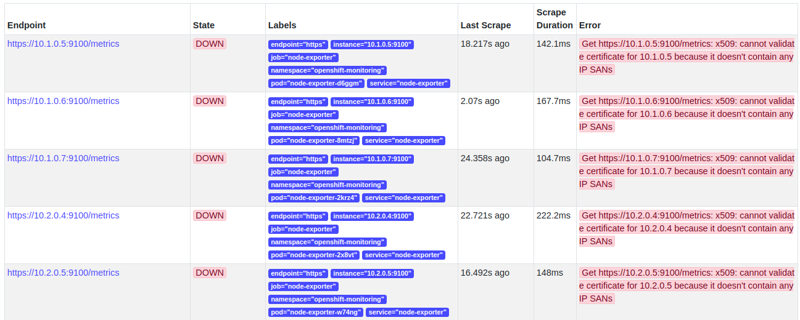

# Stack Deployment on Managed Openshift Deployed on Azure


* Common issue:

1. Openshift uses routes instead of ingress therefore routes files are added in each stack.

2. When the custom domain is provided we have to manually enter in the App domain service for the application deployed in openshift.

3. Default VM type for infra nodes is DS2_v3 which only allows 4 LUN disks to get attached. Resize the VMs after deployment. Follow steps [here](volume-attach-restriction-on-azure-ocp.md)

## Monitoring Stack Deployment

* If monitoring is enabled during deployment, a openshift-monitoring project will be deployed containing all monitoring specific services(grafana, node-exporter, prometheus and alertmanager). But the issue the grafana is that it is read-only. It means that now new dashboard can be added in it.

* Therefore it was decided that we will deploy our own monitoring stack but before deploying it make sure to stop all the services in the openshift-monitoring project.

* Make the monitoring project global:

```bash
oc adm pod-network make-projects-global <project1>
```

* When the monitoring stack was deployed the control was not able to access the monitoring stack, so these projects were joined:

```bash
oc adm pod-network join-projects --to=<project1> <project2> <project3>
```

* When the stack are deployed the node-exporter was not able to access the host ports, to resolve this issue use the command given below:

```bash
oc adm policy add-scc-to-user -z prometheus-node-exporter hostaccess -n monitoring
```

* To enable the node-exporter to scrap metrices from all nodes make sure to not assign any node specific lables to the monitoring project. Otherwise it will only scrap data from those nodes.


## Troubleshooting

### Monitoring

* When the cluster is deployed, it adds a `openshift-monitoring` project for cluster monitoring. But we will not use it because its grafana is [read only](https://docs.openshift.com/container-platform/4.1/monitoring/cluster-monitoring/about-cluster-monitoring.html). We will deploy our own monitoring stack.

* But before deploying the stack we will have to delete their `openshift-monitoring` project if the cluster monitoring is **enabled**.

* We wanted to use the node-exporter of `openshift-monitoring` with prometheus, alert-manager and grafana of stakater monitoring stack. We created a service monitor in the prometheus-operator manifest:

```
        - endpoints:
            - interval: 30s
              port: https
              scheme: https
              targetPort: 0
          jobLabel: k8s-app
          name: openshift-monitoring-sm
          namespaceSelector:
            matchNames:
              - openshift-monitoring
          selector:
            matchLabels:
              k8s-app: node-exporter

```
  the targets were created but we got certificates issue:




### Logging

* When default logging stack is deployed we get this error 

  this issue is due amount of RAM required with is 16 GB but our instance max RAM size if 8 GB. .

  its size was changed to 6 GB and also change the resource limit of the deployment to 3 min to 6 max.

* Once the above paramters are configured, es-data-master pods starts to run but it gives following errors:

  


### Jenkins

In the builder maven [image](https://github.com/stakater-docker/builder-maven/blob/master/Dockerfile), a user(Jenkins) is being created to run the mvn commnad. It works completely fine in the kubernetes, but in the openshift environment it gets stuck at the script execution part. 

By looking inside the container at run time in kubernetes environment we found out that the owner of the folders inside the container was jenkins. 

But in the openshift environment the owner was a user with id 1000.

In the dockerfile we explicitly change the user to Jenkins. So what happens in the openshift environment is that when we try to run the mvn script with Jenkins user it gets stuck because the owner of the script file is user with id 1000.


#### Solutions

This issue was resolved by using an older version of the builder maven image in which no user was being created to run the script which means default root user was used to run the script and it worked perfectly fine.


## Cluster deployment guidelines

1. Create a cluster using the `Red Hat OpenShift Container Platform Self-Managed` from the Azure Marketplace.

2. Provide the cluster configuration in deployment wizard and deploy the cluster. List  of required parameters are given below:

    | Parameter Name | Description |
    |---|---|
    | Admin Username | Cluster admin username |
    | Add User SSH public key | Cluster admin public SSH key |
    | Subscription | Subscription name |
    | Resource Group | Create a new resource group |
    | Location | Europe west |
    | OCP Cluster Name Prefix | NIL |
    | Node sizes | Size should be changes to D2s_v3 |
    | Key vault Resource Group Name | NIL |
    | Key Vault Name | NIL |
    | Secret Name | NIL |
    | Virtual Network | Default new existing virtual network |
    | Default CIDR Setting or Custom IP Range  | Default setting should be used |
    | Openshift Admin User Password | NIL |
    | RedHat Subscription Manager User Name | NIL |
    | RedHat Subscription Manager User Password | NIL |
    | RedHat Subscription Manager Openshift Pool ID | NIL |
    | RedHat Subscription Manager Openshift Pool ID for Broker / Master Nodes | NIL |
    | Azure AD Service Principal Client ID GUID | NIL |
    | Azure AD Service Principal Client ID Secret | NIl |
    | Container Native Storage | Disable it. |
    | Cluster Logging | Default logging for the cluster. Enable it. |
    | Configure Metrics for cluster | Disable it. |
    | Default Router Subdomain | Subdomain that will be used for routes in the cluster. |

3. Once cluster is deployed, the cluster can be access by two methods:

    1. `Kube config`: It is available on the bastion node. Bastion node can be accessed using the public key provided at the time of cluster deployment. Get the public ip of bastion node from the Azure portal `Cluster Resource Group -> Bastion public IP`. Use the command given below to access the bastion node.
    ```bash
    ssh -i ~/.ssh/private_key <cluster-admin-name>@<bastion-node-public-ip>
    ```

    2. `Cluster Dashboard`: Cluster console URL is available at this location `Cluster Resource Group ->  Deployments -> redhat.openshift-container-platform-XXXXX -> Outputs -> OpenshiftConsoleURL`.

4. Add an wildcard entry in the Route53 for the cluster infra load balancer ip. 

5. Resize the infra nodes to `DS2_v2` because default DS2_v3 only allows 4 disk to be attached to a node but more disks are required.

6. Clone the Stakater Infrastructure [repository](https://github.com/stakater/StakaterInfrastructure) and checkout to `azure-ocp-workshop-stakater` branch.

7. Run the `pre-install.sh` script. It will install and configure required dependencies for stacks deployment.

8. The above script will install flux, which will deploy all the stacks in the cluster but it requires access to the repository. Access the flux pod logs in the `flux` namespace. It generates a `ssh` key which is available in the pod logs that must be added to the repositories's deploy keys.

9. To check whether flux was able access the repository check the last used time of the deploy key of the project.

10. Flux will deploy the all the dependencies but the Helm Operator logs should be monitored to see whether the stacks were deployed successfully because helm operator enqueues the releases before it processes it, which takes ~5-10 minutes.

9. Run the `post-install.sh` script. It will create routes for the stacks services. Sometimes it give the error that specify port, this issue is caused by the un-deployed services. For the error generating route check whether its respective service exists.


11. To enable the Jenkins pipelines following credentials must be created:

    1. Stakater user
    2. Github token api.

10. The routes for the services are available in this [link](add playbook link).

11. To deploy application follow these steps:

    1. Run the `install` target of the `nordmart-dev-tools` pipeline. It will install flux.
    
    2. Copy the flux public ssh key from the the flux pod and add it to the repository's deploy keys.
    
    3. It will now monitor the `nordmart-dev-apps` repository.

    4. Make sure that the images specified in the `nordmart-dev-apps/releases` exists in the repository. 
    
    **NOTE**: If image doesn't exist it will generate an error that it is not able to pull the specified image although image still exists. There is a catch that new image tag will not be deployed until a succesful deployment is done.

    5. Following secrets are required for the jenkins:

        1. jenkins-maven-settings
        2. jenkins-hub-api-token
        3. slack-notification-hook

    6. Sometime jenkins create image for the branch name but not for the PR and in dev env the flux looks for the image with PR regex `^([0-9]+.[0-9]+.[0-9]+-PR-[0-9]{2}-[0-9]+-SNAPSHOT)$`. To resolve this issue just rerun the PR pipeline.

