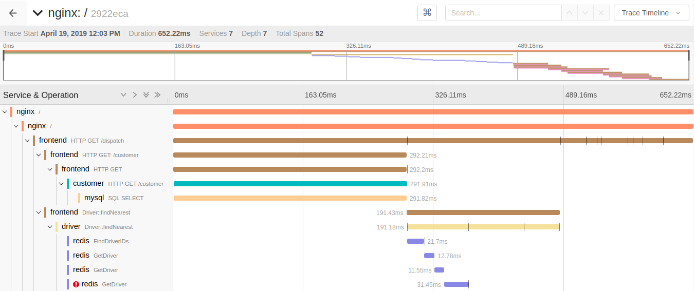
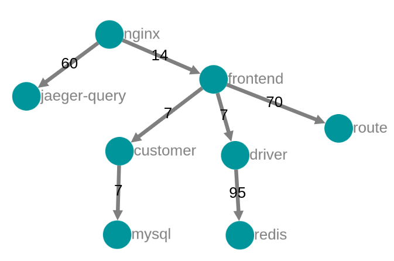

# OpenTracing

OpenTracing is a new, open standard for instrumenting applications and OSS packages for distributed tracing and monitoring. Distributed tracing enables capturing requests and building a view of the entire chain of calls made all the way from user requests to interactions between hundreds of services. It also enables instrumentation of application latency (how long each request took), tracking the lifecycle of network calls (HTTP, RPC, etc) and also identify performance issues by getting visibility on bottlenecks.

## Jaeger

Jaeger is a distributed tracing system supported by nginx-ingress that implements the OpenTracing specification. Jaeger includes components to store, visualize and filter traces.


### Agent
The Jaeger agent is a network daemon that listens for spans sent over UDP, which it batches and sends to the collector. It is designed to be deployed to all hosts as an infrastructure component. The agent abstracts the routing and discovery of the collectors away from the client.

### Collector
The Jaeger collector receives traces from Jaeger agents and runs them through a processing pipeline. Currently our pipeline validates traces, indexes them, performs any transformations, and finally stores them.

Jaeger’s storage is a pluggable component which currently supports Cassandra, Elasticsearch and Kafka.

### Query
Query is a service that retrieves traces from storage and hosts a UI to display them.

### Ingester
Ingester is a service that reads from Kafka topic and writes to another storage backend (Cassandra, Elasticsearch).

## How Jaeger works with nginx-ingress?
NGINX ingress controller can configure NGINX to enable OpenTracing instrumentation. By default this feature is disabled.
To enable the instrumentation we must enable OpenTracing in the configuration ConfigMap:
```
data:
  enable-opentracing: "true"
```

Now we will have to deploy a distributed tracing system which uses OpenTracing.
[Jaeger](https://github.com/jaegertracing/jaeger)

We must also set the host to use when uploading traces in the same configMap where we enabled the `enable-opentacing` to `true`:
```
jaeger-collector-host: jaeger-agent.default.svc.cluster.local
```
NOTE: While the option is called `jaeger-collector-host`, you will need to point this to a `jaeger-agent`, and not the `jaeger-collector` component.  

Now nginx is now configured for opentracing. But right now Jaeger UI will only show calls for nginx not the whole path/cycle where these calls are routed to and back to the nginx itself.

## How to monitor services with Jaeger using nginx-ingress?

In order to monitor services using any distributed tracing system that uses Opentracing standard, the service itself needs to support opentracing capabilities

Details can be found here: https://github.com/opentracing/opentracing-go

## Experimentation with Example application HotROD
HotROD is an example application that demostrates the tracing using Jaeger UI.
Following is the Deployment and Service configurations on a test environment.
hotrod-deploy.yaml:
```
# Source: jaeger/templates/hotrod-deploy.yaml
apiVersion: apps/v1
kind: Deployment
metadata:
  name: test-jaeger-hotrod
  labels:
    app.kubernetes.io/name: jaeger
    jaeger-infra: hotrod-deployment
    helm.sh/chart: jaeger-0.9.0
    app.kubernetes.io/component: hotrod
    app.kubernetes.io/instance: test
    app.kubernetes.io/managed-by: Tiller
spec:
  replicas: 1
  selector:
    matchLabels:
      app.kubernetes.io/name: jaeger
      app.kubernetes.io/component: hotrod
      app.kubernetes.io/instance: test
  template:
    metadata:
      labels:
        app.kubernetes.io/name: jaeger
        app.kubernetes.io/component: hotrod
        app.kubernetes.io/instance: test
    spec:
      containers:
        - name: test-jaeger-hotrod
          image: jaegertracing/example-hotrod:latest
          imagePullPolicy: Always
          env:
            - name: JAEGER_AGENT_HOST
              value: jaeger-agent.test
            - name: JAEGER_AGENT_PORT
              value: "5775"
          ports:
            - containerPort: 8080
          livenessProbe:
            httpGet:
              path: /
              port: 8080
          readinessProbe:
            httpGet:
              path: /
              port: 8080
          resources:
            {}
```
hotrod-svc.yaml:
```
# Source: jaeger/templates/hotrod-svc.yaml
apiVersion: v1
kind: Service
metadata:
  name: test-jaeger-hotrod
  labels:
    app.kubernetes.io/name: jaeger
    helm.sh/chart: jaeger-0.9.0
    app.kubernetes.io/component: hotrod
    app.kubernetes.io/instance: test
    app.kubernetes.io/managed-by: Tiller
    expose: "true"
  annotations:
    config.xposer.stakater.com/Domain: stakater.com
    config.xposer.stakater.com/IngressNameTemplate: '{{.Service}}-{{.Namespace}}'
    config.xposer.stakater.com/IngressURLPath: /
    config.xposer.stakater.com/IngressURLTemplate: '{{.Service}}.{{.Namespace}}.{{.Domain}}'
    xposer.stakater.com/annotations: |-
      kubernetes.io/ingress.class: external-ingress
      ingress.kubernetes.io/rewrite-target: /
      ingress.kubernetes.io/force-ssl-redirect: true
spec:
  type: ClusterIP
  ports:
    - name: hotrod
      port: 80
      protocol: TCP
      targetPort: 8080
  selector:
    app.kubernetes.io/name: jaeger
    app.kubernetes.io/component: hotrod
    app.kubernetes.io/instance: test
```

HotROD UI was made available at https://test-jaeger-hotrod.test.stakater.com/ through Xposer.
Jaeger UI was made available at https://jaeger-query.test.stakater.com/ 

Traces are available as Gant charts:



 as well as Dependency tree graphs:

