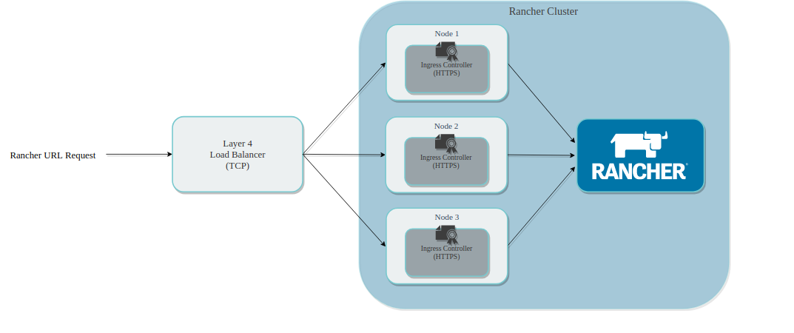
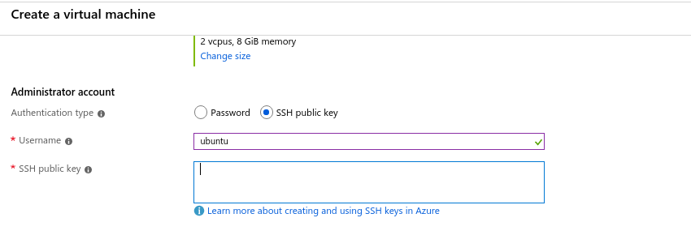

# How to setup "rancher" with a high availability configuration

**Rancher** is an open-sourced multi-cluster Kubernetes management software that provides a web interface in deploying and managing Kubernetes clusters.

## Following are the steps required to deploy a k8s cluster using rancher:
1. [Understanding HA configuration](#understand-HA)
2. [Create & set-up VMs(nodes)](#create-vm)
3. [Create load balancer](create-loadbalancer)
4. [Installing pre-requisites](install-prereq)
5. [Set up DNS](set-up-dms)
6. [Provision a k8s cluster using rke(rancher kubernetes engine)](#rke)
7. [Install helm, and deploy rancher using helm into the cluster](#rancher)
8. [Deploy a k8s cluster using rancher GUI](#rancher-gui)

### 1. Understanding HA configuration
For an HA installation of rancher following are the requirements:
 * DNS for Rancher should resolve to a Layer 4 load balancer (TCP)
 * The Load Balancer should forward port TCP/80 and TCP/443 to all 3 nodes in the Kubernetes cluster.
 * Ingress controller will redirect HTTP to HTTPS and terminate SSL/TLS on port TCP/443.
 * Ingress controller will forward traffic to port TCP/80 on the pod in the Rancher deployment.



> Soruce: https://rancher.com/docs/rancher/v2.x/en/installation/ha/

For HA installation, you have to deploy an HA RKE cluster and then deploy Rancher into it. In a 3 node architecture if we have have 3 etcd nodes and 2 controlplane nodes, our cluster is HA. To ensure high availibility of rancher you have to ensure high availibility in your k8s cluster. For reference go through [this](https://www.youtube.com/watch?v=NpT9RraqKdY)

### 2. Create & set-up VMs(nodes)
According to their official documentation the node/vm requirements are:
Supported OS: Ubuntu 16.04 (64-bit), Red Hat Enterprise Linux 7.5 (64-bit), RancherOS 1.4.0 (64-bit)
Hardware: 2 VCPUs, 8 GB RAM for deploying up to 5 clusters with up to 50 nodes
> Source: https://rancher.com/docs/rancher/v2.x/en/installation/requirements/

We used **Azure** as our cloud provider for this installation and we created a new resource group for `rancher` and created 3 VMs with the following configuration: 
OS: Linux (ubuntu 18.04)
Hardware: Standard D2s v3 (2 vcpus, 8 GiB memory)
Disk: 256 GiB (Premium SSD)

Ensure that these VMs are accessible via your devstation(local workstation;laptop, computer etc.). To do so while creatin VM the option "SSH public key" as authentication type, create a key pair on your devstation and copy the public key in each of the corresponding VMs.



If you opt not to, you can do it later by generating a key-pair and copying public key to your VMs at path ./ssh/id_rsa_pub or ./ssh/associated_keys. To generate key-pair use command `ssh-keygen`

Once, it's done ssh into your nodes and run the following commands to turn off swap, install docker, enable/start docker.service:

```
swapoff -a
sudo apt-get update
sudo apt-get install -y docker.io
sudo usermod -aG docker $(whoami) # Might need to logout and login again for this command to take effect
sudo systemctl enable docker.service
sudo systemctl start docker.service
sudo reboot
```
Also, open the following ports for incoming traffic: 80, 443, 22, 2376, 2379, 2380, 8472, 9099, 10250, 6443, 10254, 30000-32767
> Source: https://rancher.com/docs/rke/latest/en/os/#ports

**Your nodes are all set-up at this point. All commands from now onwards wil run from your devstation**

### 3. Create Load Balancer
On azure: https://www.youtube.com/watch?v=-VMPzVoo5Nk
On aws: https://docs.aws.amazon.com/elasticloadbalancing/latest/classic/elb-getting-started.html

Create a load balancer and make it balance load between the three VMs that we created

### 4. Installing pre-requisites
On your devstation install the following: 
1. [kubectl](https://kubernetes.io/docs/tasks/tools/install-kubectl/#install-kubectl) (Client Version: v1.15.3 - Server Version: v1.13.11+IKS)
2. [helm](https://helm.sh/docs/using_helm/#installing-helm) (v2.12.1 or higher)
3. [rke] (https://rancher.com/docs/rke/latest/en/installation/#download-the-rke-binary) (0.3.0)

### 5. Add DNS entry
Add a DNS entry either in azure dns or aws route 53. We used route 53 and added an CNAME record for our desired hostname `rancher.test.stakater.com` pointing to the address of our load balancer.

### 6. Provision a k8s cluster using rke(rancher kubernetes engine)
Run the following commands to run rke:

```
wget https://github.com/rancher/rke/releases/download/v0.3.0/rke_linux-amd64
mv rke_linux-amd64 rke
chmod +x rke
export PATH=/home/ubuntu/rke:$PATH #either add to PATH or use ./rke (from the location where rke executable exists)
```
Once, rke is installed your need a valid config to deploy a k8s cluster. Config can be generated by using `rke config` command but i'd advise against it since it had too many bugs in it. Instead just use the following config and let rke use defaults for all the unchanged attributes.
Save the following as config.yml and replace public and internal IPs.

```yaml
nodes:
  - address: node1_public_ip
    internal_address: node1_internal_ip
    ssh_key_path: ~/.ssh/id_rsa
    user: ubuntu
    role:
      - controlplane
      - etcd
      - worker
  - address: node2_public_ip
    internal_address: node2_internal_ip
    ssh_key_path: ~/.ssh/id_rsa
    user: ubuntu
    role:
      - controlplane
      - etcd
      - worker
  - address: node3_public_ip
    internal_address: node3_internal_ip
    ssh_key_path: ~/.ssh/id_rsa
    user: ubuntu
    role:
      - controlplane
      - etcd
      - worker
```

Now run `rke up`. This will take around 10-15 mins. On success, it will generate a `kube_config_cluster.yml`, set that as your current k8s config.
Run `kubectl get nodes` to ensure that all 3 nodes are up and running:
```
$ kubectl --kubeconfig kube_config_cluster.yml get nodes
NAME    STATUS    ROLES                      AGE       VERSION
node1   Ready     controlplane,etcd,worker   3m        v1.15.4
node2   Ready     controlplane,etcd,worker   3m        v1.15.4
node3   Ready     controlplane,etcd,worker   3m        v1.15.4
```
### 7. Initialize helm, install cert-manager and deploy rancher using helm into the cluster
Run the following command to initialize helm: 

```
kubectl -n kube-system create serviceaccount tiller

kubectl create clusterrolebinding tiller \
  --clusterrole=cluster-admin \
  --serviceaccount=kube-system:tiller

helm init --service-account tiller
```
run `kubectl -n kube-system  rollout status deploy/tiller-deploy` and watch the deployment status. Once done, start with the installation of rancher:

1. Add required chart repo `helm repo add rancher-latest https://releases.rancher.com/server-charts/latest`
2. Install the CustomResourceDefinition resources `kubectl apply -f https://raw.githubusercontent.com/jetstack/cert-manager/release-0.9/deploy/manifests/00-crds.yaml`
3. Create namespace for cert-manager `kubectl create namespace cert-manager`
4. Add label `kubectl label namespace cert-manager certmanager.k8s.io/disable-validation=true`
5. Add helm repo for cert-manager `helm repo add jetstack https://charts.jetstack.io`
6. `helm repo update` and install cert-manager `helm install  --name cert-manager  --namespace cert-manager  --version v0.9.1  jetstack/cert-manager`
7. Install rancher with certifcate set from letsEncrypt `helm install rancher-latest/rancher --name rancher --namespace cattle-system --set hostname=rancher.test.stakater.com --set ingress.tls.source=letsEncrypt --set letsEncrypt.email=youremailaddress@host.com`
8. Wait for rancher to be deployed `kubectl -n cattle-system rollout status deploy/rancher`

**Note**: Before step 7 ensure that a valid DNS entry is added against your load balancer and use [dnschecker](https://dnschecker.org/) to ensure that it has been resolved. Else, letsEncrypt won't be able to generate a valid certificate against our hostName.
At the time of documentation `cert-manager v0.11.0` had compatibility issues with rancher. Go through this [issue](https://github.com/rancher/rancher/issues/23424) for details.

### 8. Deploy a k8s cluster using rancher GUI 
Access `rancher.test.stakater.com` and create a new password. Rancher is now up and runing :tada:. Go to `clusters`, create cluster and then create a cluster based on your desired config.


## Useful links: 
https://www.youtube.com/watch?v=WPzvF_-MVkg
https://www.youtube.com/watch?v=NpT9RraqKdY
https://blog.kubernauts.io/enterprise-grade-rancher-deployment-guide-ubuntu-fd261e00994c
https://itnext.io/setup-a-basic-kubernetes-cluster-with-ease-using-rke-a5f3cc44f26f
https://github.com/jmreicha/awesome-rancher
https://rancher.com/docs/rancher/v2.x/en/installation/ha/
https://rancher.com/docs/rancher/v2.x/en/troubleshooting/
https://rancher.com/docs/rancher/v2.x/en/troubleshooting/rancherha/
